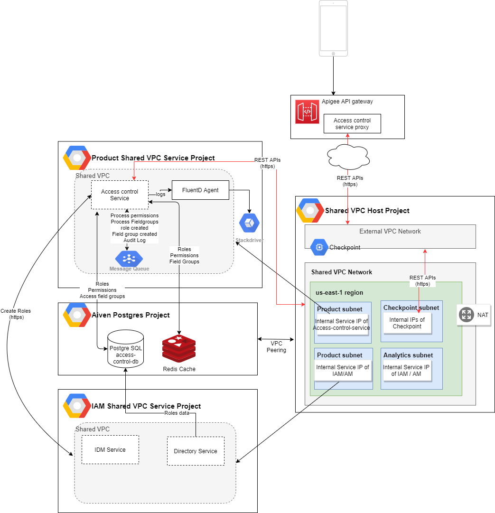

*# Access Control Service User Guide

This overview explains how to use the [Access Control Service API](reference/AccessControlServiceYAML.yml) when configuring a deliverable. 

## What is the Access Control Service?

Essentially, Access Control Service APIs are a mesh of policies that govern the following elements of access control for a microservice:

1. **The creation and maintenance of permissions**; these are mapped to pre-defined user roles in the application.

2. **Consent management**, which is a more granular way to set ownership within the context of user roles: essentially, it controls who can access what data, and tracks official patient consent to share records and data with other users. 

Application developers use these APIs to control the type of access granted, consent behavior, and the data that is visible for each user role. By default, the IT Administrator is given ownership of all permissions in the service.  Application developers can configure consent management to provide more granular control over data. For example, within an organization, a physician may be given access to all his or her patients' data or only some fields of patient data, indefinitely or for a set period of time, and may be able to grant access to other physicians or other roles in the organization.  A user role can also be configured to inherit permissions from another role.

This allows application developers to easily set permissions and user access independently of other BrightInsight APIs, ensuring a good and consistent end-user experiences and smooth IT administration. BrightInsight developers typically provide the initial configuration and these remain in place once they have been tested and put into production.

## How it Works

The diagram below illustrates the Access Control Service architecture:

## Getting Started

**Note**: Please use the Java version 11 or higher, Maven version 3.6.1 or higher
1. Check out the code.
2. Run mvn clean install.
3. Add the following dependency to pom.xml:

"xml <dependency> <groupId>com.brightinsight.platform.common</groupId> <artifactId>access-control</artifactId> <version>1.0.0-SNAPSHOT</version> </dependency>"

4. Add this line to your application.properties: 

"properties access.control.event.topic.field.group=[Event's Topic Name for FieldGroup. If not set then default value will be processAccessControlGroup] access.control.directory.path.field.group=[Path to the directory which stores JSON files for Field groups. If not set then default value will be access-control/field-groups] access.control.event.topic.api.permission=[Event's Topic Name for API permissions. If not set then default value will be processApiPermissions] access.control.directory.path.api.permission=[Path to the directory which stores JSON files for API permissions. If not set then default value will be access-control/api-permissions]"

**See Also**: [API Terminology](../docs/API-Terminology.md)

## APIs in This Set

The endpoints of the [Access Control Service API](reference/AccessControlServiceYAML.yml) are summarized below. 

To see the API itself, see [Access Control Service API](reference/AccessControlServiceYAML.yml).

### Permissions APIs

These APIs enable the application developer to configure permissions.

API Code	| API Name	| URL   	|How it works	| Use for
----------|-----------|---------|-------------|---------
API-ACS01	| Create Permissions	| POST /permissions	| product.plt.access.control.service.permission.create	| Enables the creation of new permissions, which can be mapped to predefined user role(s).	| Enabling a user to create new permissions (based on a predefined permissions template). 
API-ACS02	| Create Role	| POST /roles	| product.plt.access.control.service.role.create	| Enables the creation of a new user role, including role name, description, multi-factor authentication, location, and a list of permissions.	| Enabling a user to create a new user role. 
API-ACS03	| Update Roles	| PUT /roles	| product.plt.access.control.service.role.update	| Enables updates to any field for an existing user role, by first checking that the role exists, and then validating all required information.	| Enabling a user to update data for a user role.	
API-CS09	| Add Permissions	| POST /roles	| product.plt.access.control.service.role.add.permissions	| Enables a user to add permissions to an existing role.	| Enabling a user to add more permissions to an existing role.

### Consent Management APIs

These APIs enable the application developer to configure consent management.

API Code	| API Name	| URL   	|How it works	| Use for
----------|-----------|---------|-------------|---------
API-ACS04	| Create Consent Field Group	| POST /field-group	| product.plt.access.control.service.fieldgroup.create	| Enables a user to create a new consent form, by first checking that it does not already exist, and then validating all required information.	| Enabling a user to set up a new consent form using predefined consent fields. 
API-CS05	| Get Consent Assignments for Recipient	| GRPC Service name: ConsentAssignmentService	| Function Name	| getConsentAssignmentForRecepient	| product.plt.access.control.service.consent.assignment.get	| Applies predefined consent assignments from an external GRPC service to a recipient.	| Assigning consent to a user from another service.
API-CS06	| Create Consent Template	| TBD	| TBD	| TBD
API-CS07	| Create Consent Assignment	| TBD	| TBD	| TBD
API-CS08	| Create Consent Template	| Post /consent-template	| Creates a new consent template.	| TBD

**Next:** [See How BrightInsight APIs are Organized](../docs/HowBrightInsightAPIsareOrganized.md)