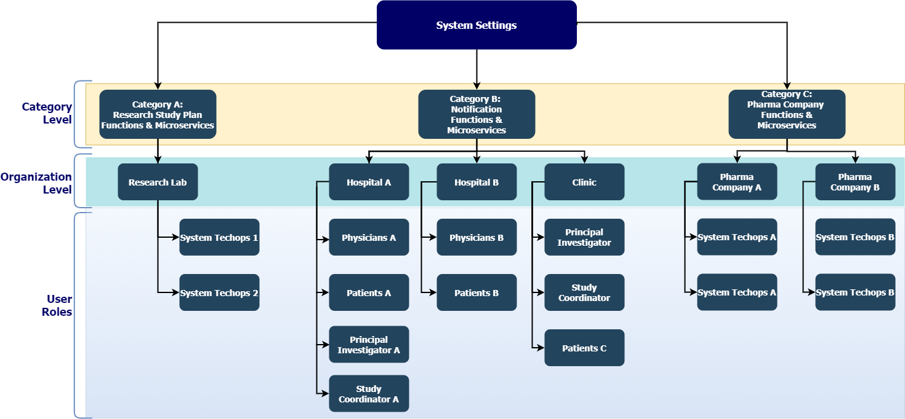

# Configuration Service API User Guide

This guide explains how to use the [Configuration Service API](reference/ConfigurationServiceAPI.yml) when configuring a deliverable. 

**Note**: [See the API Overview](../docs/Overview.md)

## What is the Configuration Service?

Essentially, Configuration Service APIs are a mesh of policies governing functionality and microservices in a customer solution. Application developers use them to configure and adjust the behavior of functionality and independent microservices as they are packaged for an application, controlling how those objects communicate with each other and external systems. This allows them to easily implement permissions and data policies mapped directly to application behavior outcomes, ensuring good end-user experiences. BrightInsight developers typically provide the initial configuration and these remain in place once they have been tested and put into production.

The Configuration Service enables preferences and settings for system functionality and microservices to be handled at a global level. Some Configuration Service APIs are External (exposed to the internet via APIgee), while others are Internal (only called by other BrightInsight microservices).

### How System Settings Govern Functions and Microservices
System settings are global rules that filter down through two levels to control what End-Users can see and do in the customer solution. The example below illustrates how system settings for a deliverables are inherited at the Category and the Organizations level, and then for User roles.

The architecture above enables the BrightInsight developer to configure system settings at a global level and then refine behavior for different use cases, user roles, or types of care.

**See Also**: [API Terminology](../docs/API-Terminology.md)

## APIs in This Set
The endpoints of the Configuration Service are summarized below. 

To see the API itself, see [Configuration Service API](reference/ConfigurationServiceYAML.yml).

### System Settings APIs

API Code	| API Name	| URL   	|How it works	| Use for
----------|-----------|---------|-------------|---------
CS-01 	|Create System Setting| POST /system-settings	| Establishes system settings in batch for related functions and microservices in use for the deliverable. |	Setting global behavior that can be applied to each microservice, such as organization-level override and user-level edits.
CS-02	|List System Settings	| GET /system-settings	| Fetches settings for the system.	| Looking up settings at the system level, agnostic of categories, organizations, and users that may be associated with them.
CS-03	| Get System Settings	| GET /system-settings/{id}	| Fetches a single system setting. 	| Looking up a single setting.
CS-04	| Update System Setting	| PUT /system-settings/{id} | Changes settings for the system	| Modifying behavior settings for entire system, affecting all associated categories, organizations, and users.
CS-05	| Patch System Settings	| PATCH /system-settings/{{systemSettingId}}	| Updates particular settings for the system		| Updates particular system settings without updating all settings.
CS-06	| Delete Setting	| DELETE /system-settings/{id}	| Removes settings for the system		| Removing settings at the system level, affecting all associated categories, organizations, and users.

### Category APIs

API Code	| API Name	| URL	| How it works	| Use for
----------|-----------|---------|-------------|---------
CS-07	| Create Category	| POST /categories | Establishes a category to which system settings can be assigned.	| Categorizing system settings to make them easier to administer.
CS-08	| List Categories	| GET /categories	| Fetches all settings under a category (including overridden values for the organization and the organization defaults)	| Looking up behavior settings associated with a particular category. 
CS-09	| Update Category	PUT /categories/{id}	| Changes settings under a category	| Modifying which behavior settings are associated with a particular category. 
CS-10	| Update Category	|	PUT /categories/{id}	| Changes category information	| Modifying information for a category. 
CS-11	| Patch System Categories	| PATCH /categories/{id}	| Updates particular settings for the system	| Updates particular categories without updating all categories.
CS-12	| Delete System Category	| DELETE /categories/{id}	| Removes a category setting	| Deleting a category of settings.

### Organization-to-Category APIs

API Code	| API Name	| URL	| How it works	| Use for
----------|-----------|---------|-------------|---------
CS-13  | Add Organization to Category	| POST /categories/{{categoryId}}/organization/{{organizationId}}	| Adds an organization to a settings category 	|  Associating an organization with a system settings category so that those settings can be applied to that organization.
CS-14	| Remove Organization  from Category	| DELETE /categories/{{categoryId}}/organization/{{organizationId}} 	| Deleting an organization from a system settings category so that those settings are no longer applicable to the organization. 	| Disassociating an organization from a system settings category.

### Organization Settings APIs
API Code	| API Name	| URL	| How it works	| Use for
----------|-----------|---------|-------------|---------
CS-15	| Get Organization Settings 	| GET /organization-settings?&category=<categoryName>&organizationId=<organizationId>	|  Retrieve a list of system settings associated with an organization, by organization ID. 	|  Looking up which settings are associated with an organization.

### User Settings APIs 
API Code	| API Name	| URL	| How it works	| Use for
----------|-----------|---------|-------------|---------
CS-16	| Create User Settings	| POST /user-settings	| TBD	| TBD
CS-17	| Get User Settings	| GET /user-settings?user-did=<userDid>&category=<categoryName>&organizationId=<organizationId> 	| Retrieve a  list of settings associated with a User, by ID, optionally filtered by system settings category. 	| Looking up which settings are associated with a specific user.

**Note**: *How Categories and System Settings are Related*:
- GET /categories/{{categoryId}}/system-settings  - List all system settings in category
- POST/PUT(?)  /categories/{{categoryId}}/system-settings/{{systemSettingId}} - Create relationship between categorey and system setting
- DELETE  /categories/{{categoryId}}/system-settings/{{systemSettingId}} - Delete relationship between categorey and system setting

**Tip**: Batch save for multiple system settings to a category

**JSON example**:

{

  "systemSettingId":"dfd57057-7f76-44cf-883c-82b41d87a04a", 

  "key":"SEND_REPORT", //Unique, not null 

  "value":"true", //not null /

  "dataType":"BOOLEAN", //not null can be any of this: STRING, INTEGER, FLOAT, BOOLEAN, DATETIME, ENUMERATION /ion", //optional 

  "allowOverride":false //default false 

}
