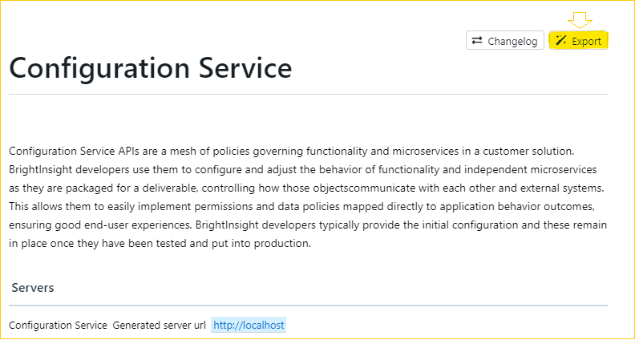

# How Bright Insight APIs Are Organized

This section explains how our APIs are organized so you can navigate them and apply them to your implementation.

An API is an application programming interface, which is a set of rules that lets programs talk to each other, exposing data and functionality across the internet in a consistent format.

REST, [Representational State Transfer](http://www.ics.uci.edu/~fielding/pubs/dissertation/rest_arch_style.htm), is an architectural pattern that describes how distributed systems can expose a consistent interface. The term “REST API” means an API accessed via HTTP protocol at a predefined set of URLs. These URLs represent various resources. Resources are information or content accessed at that location, which can be returned as date in the form of JSON, HTML, audio files, or images. These resources often have one or more methods that can be performed on them over HTTP, like GET, POST, PUT, PATCH, and DELETE. 

## How Is Information Organized in BrightInsight APIs?

In Swagger, APIs are listed by method, URL, and then title. Each method is color-coded, and when you click on it, the details expand below. Often BrightInsight APIs are grouped in sections to help you find what you need. These display in the code as “tags.”

### Parameters, Responses, and Extensions

Each API lists Parameters, if any, and Responses. As you develop your application, you should review and edit these to your preferences. Error messages are generic and provided as templates. You may also work with any available Extensions in a section at the bottom of the API description. 

### Operation IDs

Every BrightInsight API has an operation ID, listed within the API as a tag. These IDs use the naming convention “API-CS##”, such as “API-CS01”. You can easily locate an API using these IDs, or by using the API name.

### Examples and Schemas

To see examples and schemas for an object, expand the API, then under the object, locate the **Example Value** and **Schema** toggles. 

Clicking either changes the display to show examples or schemas.

### Components or Models

Compliant with the Open API Specification (OAS) 3.0, BrightInsight APIs organize the following reusable objects in a #/components section in the code:
- [ ] responses 
- [ ] parameters 
- [ ] examples
- [ ] requestBodies
- [ ] headers
- [ ] links
- [ ] callbacks
- [ ] schemas

**Tip:** Swagger is simply a way to view an API, it is actually the specification on which the API code is built. You can view APIs in many applications that use the same format spec. and simply *consume* the YAML. 

## Downloading the YAML File

BrightInsight Platform 2.0 APIs are presented in this Portal in Stoplight, which is a web application that works very much like Swagger and also allows you to export the API in YAML to use for application development (example below)

## Viewing Models/Schema

When an API has a referenced model or schema, there are several ways to view that relationship.

- **Here in the Developer Portal**, Stoplight shows referenced models/schemas in an **Others**  list on the left for each microservice (example below).

- **In Swagger**, you can view the Models under the **Schema** toggle for each API (example below). 

**Note**: You will also find these components listed seperately as a long list at the bottom of the Swagger display in grey.
