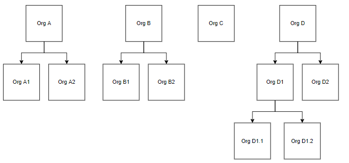

# Organization Service API User Guide

This overview explains how to use the [Organization Service API](reference/OrganizationServiceAPI.yml) when configuring a deliverable, and is intended for application developers who are using this microservice to build a custom application.

# What is the Organization Service?
Essentially, Organization Service APIs are a mesh of policies governing organizations in a customer solution. BrightInsight developers use them to define and work with organizations and how they are assigned to functions and microservices in the customer application. This allows them to easily map permissions and data policies for each organization. BrightInsight developers typically provide the initial configuration and these remain in place once they have been tested and put into production.

## How it Works
Organization settings control the functionality available to end-users in each organization defined for the customer solution. End-users are assigned to each organization and thereby affected by the controls of the Organization microservice. This architecture enables the BrightInsight developer to configure organizations independently of other BrightInsight microservices, and then assign them as needed, making it easy to administer access and functionality from other microservices by organization. 

**See Also**: [API Terminology](../docs/API-Terminology.md)

### Functional Rules
The functionality rules below govern behavior for all APIs in this set.
1.	System settings belong to one or more category.
2.	Every microservice is assigned to a category.
3.	A user belongs to one or more organization.
4.	A system setting is only available to the user when it is assigned to an organization.
5.	System setting categories can be assigned to an organization.
6.	Organization settings can be inherited by the users assigned to the organization.
7.	The user can override the setting of the Organization if specifically allowed.
8.	All data in the system can be cached in memory except for user overrides, which will be fetched from the database.

## APIs in This Set
The endpoints of the Configuration Service are summarized below. To learn more about a specific API, follow the link in the left column.

API Code	| API Name	| URL   	|How it works	| Use for
----------|-----------|---------|-------------|---------
API-OS01 	| Create Organization	| POST /organizations	| Establishes a new organization as a parent or as a child to another organization.	| Creating a new organization, setting it as active or inactive, and describing it.
API-OS02	| Get Organizations	| GET /organizations/{id}	| Fetches a paged list of organizations defined for the system.	| Looking up all organizations. 
API-OS03	| Get Organization	| GET /organizations/{id}	| Fetches an organization.	| Looking up settings for a single organization.
API-OS04	| Update Organization	| PUT /organizations/{id}	| Changes settings for an organization.	| Modifying settings for an organization, such as active/inactive status.
API-OS05	| Patch Organization	| PATCH/ organizations/{id}	| Change specific settings for an organization.	| Modifying particular settings for an organization.
API-OS06	| Delete Organization	| DELETE /organizations/{id}	| Removes an organization from the system.	| Deleting an organization (without removing end-users assigned to that organization).
API-OS07	| Get Child Organizations	| GET /organizations/{id}/children	| Fetches a list of child organizations under an organization.	| Looking up the organizations that are descendants of an organization.
API-OS08	| Get User Organization	|GET /organizations/user	| Fetches a paged list of organizations that the current user is enrolled in.	| Use to list the organizations with which the user is associated.

**Next: **[See How BrightInsight APIs are Organized](../docs/HowBrightInsightAPIsareOrganized.md)