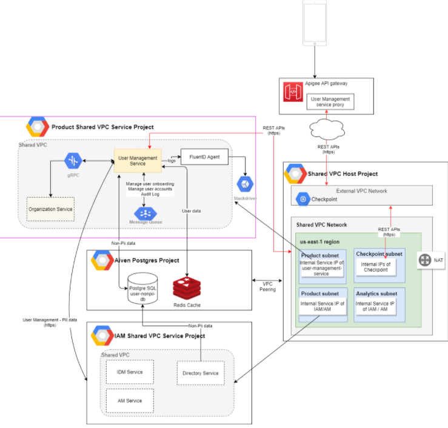

# User Management Service User Guide

This overview explains how to use the [User Management Service API](reference/UserManagementServiceAPI.yml) when configuring a deliverable, and is intended for application developers who are using this microservice to build a custom application.

## What is the User Management Service?
Essentially, User Management Service APIs govern the creation of end-users in the Customer application including how they are invited to use it, and once they are onboarded, these APIs also control how they can update their passwords and profile information.  BrightInsight developers use them to configure and adjust three types of functionality:

1. **User Provisioning**: the assignment of user roles to an end-user of a microservice.

2. **User Onboarding**: the process of inviting an end-user to access and register for the microservice, and managing invitation status.

3. **Password and Profile Management**: enables user to change and reset passwords and profile info and  governs password expiration behavior.

This allows application developers to easily set behavior for user management independently of other BrightInsight APIs, ensuring good and consistent end-user experiences. BrightInsight developers typically provide the initial configuration and these remain in place once they have been tested and put into production.

## How it Works

The diagram below illustrates the User Management Service architecture:

**See Also**: [API Terminology](../docs/API-Terminology.md)

## APIs in This Set

The endpoints of this microservice are summarized below. 

To see the API itself, see [User Management Service API](reference/UserManagementServiceYAML.yml).

### User Onboarding APIs

These APIs enable the customer application to invite end-users to access the application and register, and manage invitation status.

API Code	| API Name	| URL   	|How it works	| Use for
----------|-----------|---------|-------------|---------
API-UM1	| Invite User For Registration	| POST /invitations/user-registration	| Generates an invitation in the system. This invitation will allow the invitee to act on it and sign up as a user in the BI platform.	| Inviting end-users to access and register with the customer application, such as inviting someone to join a clinical trial study.
API-UM2	| Accept User Registration Invitation	| POST /invitations/user-registration/{invitation-code}/action?action={action}	| Acts on an existing invitation so the end-user gets provisioned in the platform.	| Provisioning new end-users so they can use the customer application.
API-UM3	| Extend Invitation	| PUT /invitations/{invitation-code}/extend	| Extends an invitation by recalculating the expiration date of the invitation.	| Extending the end-date of the invitation to give the end-user more time to accept it.
API-UM4	| Get Invitation	| GET /invitations?invitation-id={invitation-id}&code={code}&status={status}&role-name={role-name}&org-id={org-id}&expire-date-from={expire-date-from}&expire-date-to={expire-date-to}&accepted-date-from={accepted-date-from}&accepted-date-to={accepted-date-to}	| Queries information on invitation requests.	| Looking up the status of invitations.
API-UM5	| Cancel Invitation	| DELETE /invitations/{invitation-code}	| Changes the invitation status to CANCELLED.	| Cancelling an invitation so a user can no longer access the customer application to register.
API-UM9	| Create User	| POST /users	| Creates a user in the system.	| Creating new users.	
API-UM10	| Resend User/Verify User	| POST /users/verify	| Prompts the user to verify the account.	| Send or resend a user an email to verify the account (for example, in case the first email expired).

### Password and Profile Management APIs

These APIs enable the end-user to change and reset passwords, edit profile info, and manage password expiry behavior.

API Code	| API Name	| URL   	|How it works	| Use for
----------|-----------|---------|-------------|---------
API-UM6	| Update User Profile	| PUT /users/{user-id}	|  Allows an end-user to change his or her profile.	| Enabling users to edit their profiles.
API-UM7	| Change Password	| POST /change-password	| Allows an end-user to change his or her password.	| Enabling users to change their passwords.
API-UM8	| Reset Password	| POST /reset-password	| Lets a user change the password when current password is unknown (forgotten, for example).	| Enabling users to enter a new password without having to enter the old one.
**Note**:  Resetting a password differs from changing a password. The Change Password API (API-UM7) expects to receive both the current and new passwords in the request payload (which means the user must know current password, but wants to change it). Reset Password (UM8) will let a user change the password when current password is unknown (forgotten, for example).

**Next: **[See How BrightInsight APIs are Organized](../docs/HowBrightInsightAPIsareOrganized.md)